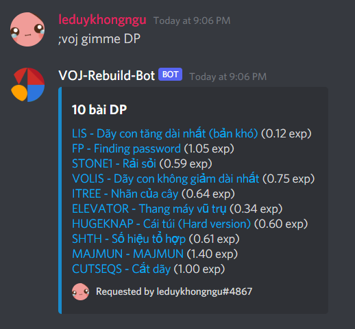
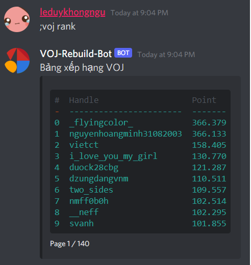
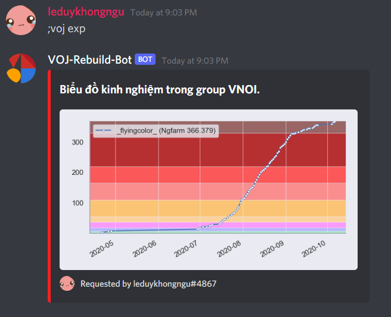
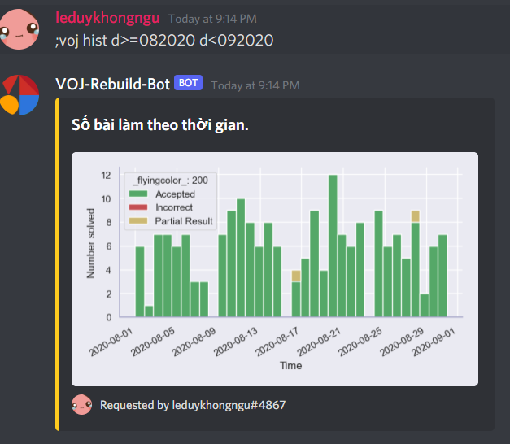
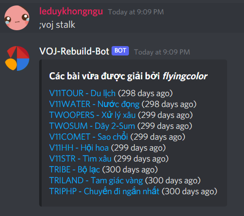
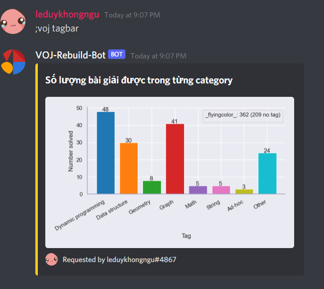
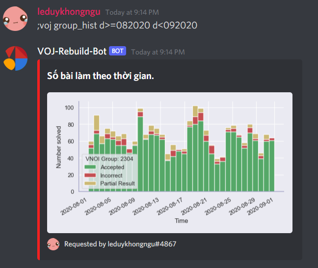

# VOJ-ranking-bot
 A Discord bot which helps calculate ranking in a Codeforces group. It also plots various data like rating distributions, user submission statistics.

## Features
### Get suitable problem for training

### Ranking
- Create group ranking:

### Graph
- Plot rating history:

- Plot training history (number of submission per day):

- Plot training history by number of submission:

- Get list of solved problems:

- Plot training history by number of solved problem per problem category:

- Plot rating distributions of a group:

### Other
- For VNOI: get codeforces link of a [VOJ](http://vn.spoj.com/) problem 
- Some git commands to update the bot.

## Installation
Clone this repository 
- `python pip install -r requirements`
- Base on file `.env-example`, create file `.env` and fill all the data: bot token, account codeforces (for crawling submission), codeforces group id, access link to Mongo db atlas.

## How to use
- Create a discord bot, add it to your discord server.
- Then use `python main.py` to run the bot. Remember to edit data in `.env`.
- Use `;voj help` to see list command

## Crawler
Because there is no APIs to get submissions data directly, I have to get it myself by crawling the Submission page of Codeforces group.

You can see the crawler in `/service/SubmissionCrawler.py`.

### Issues
This is some sort of issues and I'm not figure out how to solve it: 
- What if a user change their handle? Since Codeforces allow users change their handle once time per year. 
- What if we rejudge a problem? If we rejudge a problem, all the submission information about that problem have to delete and re-crawl but I don't know how to do since there is no APIs.
- What if we rename a problem? 

## Q&A
- Question: How rank is calculated? Answer: Each problem has a point, equal to `80 / (40 + x)` with `x` is number of users got accepted in that problem. If a user submit to a problem and receive a accepted verdict, they will earn all the problem's point. If they receive a partial score, they will earn `partial_score` * `problem_point` / 100 points.

## Note
- There is some commands required `Admin` role. If you're not bot's owner, you will need `Admin` role to use those commands.
- You can update the bot (get new commit from this repository) by using `;voj git_pull` command. Then you can use `;voj restart` to restart the bot (you don't need to run it again, it's very useful since I'm running the bot in a VPS).
